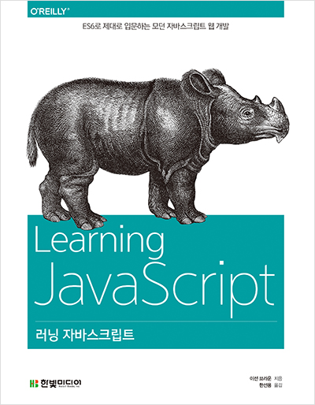
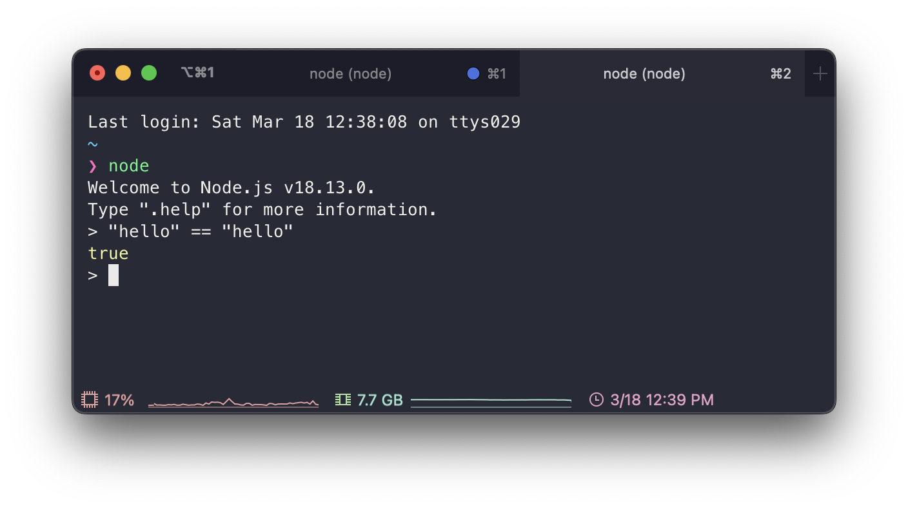
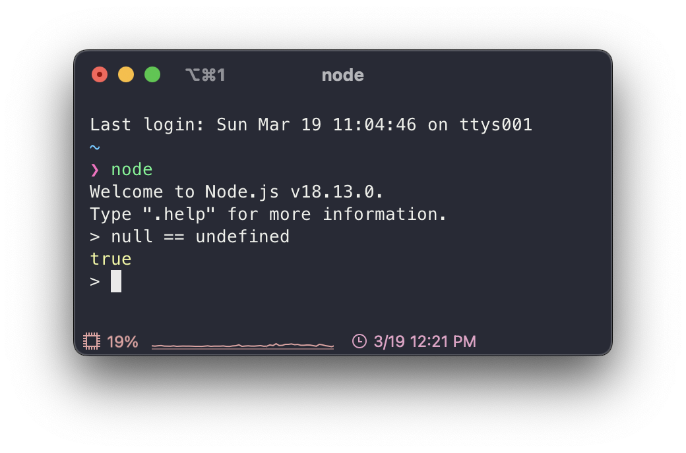
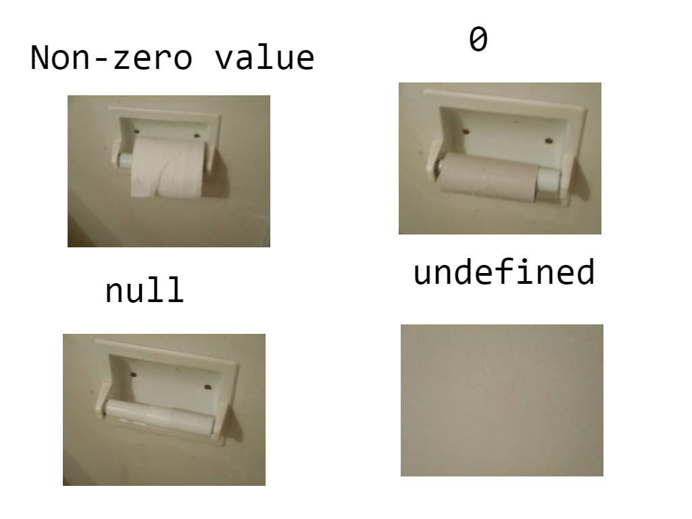
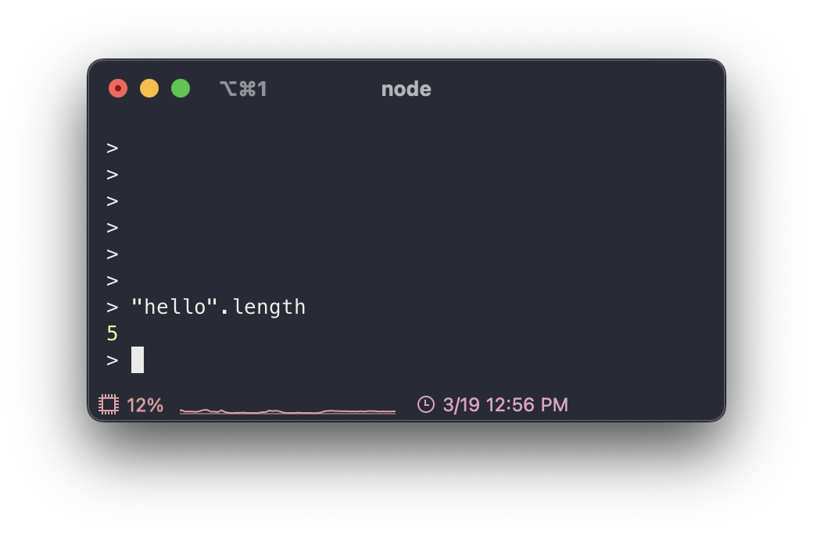
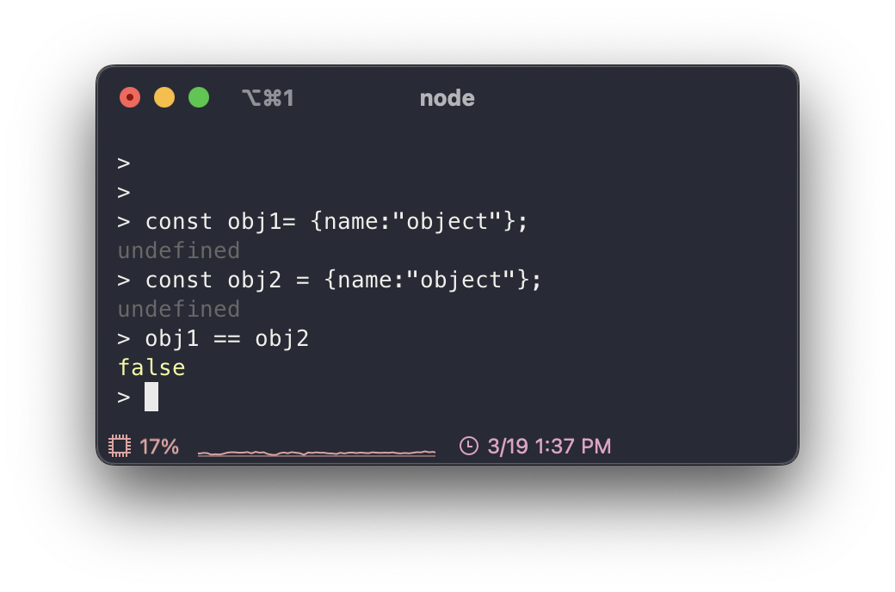
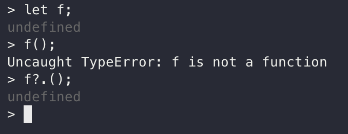

예전에 읽었던 이선 브라운의 러닝 자바스크립트라는 책으로 다시 JavaScript를 복습했다. MDN 문서를 참조해서 만든 책이다 보니깐 신뢰할 수 있다고 생각해서 다시 읽게 됐다. 지금 당장은 map, iterator, async 등의 파트는 잠시 미뤄두고 기본적인 부분을 위주로 복습해나갔다. 해당 부분들은 다음에 추가로 작성해나가려고 한다.

## JavaScript?

객체 기반의 스크립트 프로그래밍 언어로 브렌던 아이크(Brendan Eich)가 모카라는 이름으로 만든 언어이다. 자바랑은 아무 연관이 없는 언어이지만 닷컴버블 당시 자바는 떠오르는 인기 있는 언어였다 보니 마케팅 목적으로 자바를 붙여 불렀다.

참고로 브렌던 아이크는 Mathematics와 Computer science 학사를 취득했으며 박사 과정까지 밟았다. 그 후에 10년 정도 산업(시스템 분야)에서 일하다가 Netscape에 1995년 4월 입사했고 Scheme의 함수성, Self의 객체지향, Java의 구문법과 같이 각 장점을 뽑아 10일 만에 첫 번째 버전을 만들고 그해에 JavaScript라는 이름을 내걸고 발표했다. 현재는 Brave Software를 설립했고 해당 회사는 흔히 알려진 Brave Browser를 만든 회사이다.

> ref. [Brenda Eich - Wikipedia](https://en.wikipedia.org/wiki/Brendan_Eich), [JavaScript - Wikipedia](https://en.wikipedia.org/wiki/JavaScript)

추후 Netscape는 JavaScript를 European Computer manufactures Association(ECMA)에 표준화를 위해 제출했고 ECMAScript 명세가 나오게 되었다. 현재 꾸준히 업데이트되어 ES10까지 나왔지만 2015년에 나온 ES6를 기준으로 ES6 또는 ES6+라고 부른다. 다만 브라우저의 버전마다 지원하는 ES 버전이 다르므로 Transpiling 하는 과정이 필요할 수 있다. 이를 잘 담당해주는 라이브러리(Babel)가 있으니 걱정은 안 해도 될 것 같다.

```html
<script src="main.js" />
```

Javascript는 JS 파일 확장자를 가지고 link 태그를 사용해서 CSS 파일을 가져온 것처럼 JS는 script 태그를 사용해서 가져올 수 있다.

## 변수(var, let), 상수(const), 데이터 타입

### let, const

변수를 선언할 때 JS는 데이터 타입을 명시하지 않고 대신 변수 혹은 상수임을 나타내는 let, const를 사용한다. 또한 초기화하지 않으면 쓰레깃값을 가지고 있는 것이 아니라 undefined 값이 할당된다.

const는 C에서 상수를 define 한 것처럼 한번 초기화하고 바뀌면 안 되는 값을 const로 선언하여 안전하게 프로그래밍할 수 있다.

let, const 개념은 ES6에 나온 것으로 일단 scope 차이가 있다고 생각하고 넘어가면 될 것 같다.

> let, const는 block scope를 가지고 있고 var는 function scope를 가진다. 자세한건 Scope 파트에서 다루도록 하자.

### Data type

JS의 값은 Primitive와 object로 나뉜다.

- primitive
  - 숫자
  - 문자열
  - 불리언
  - null
  - undefined
  - symbol
- object
  - Array
  - Date
  - RegExp
  - Map
  - Set

#### Number

보통의 언어들은 정수, 실수로 나누고 또 그 안에서 data size 별로 또 나뉘지만, JavaScript는 그렇지 않고 일괄적으로 IEEE 764 Double precison Number을 사용한다.

#### String



위와 같이 비교 연산자로 문자열 비교가 가능하고 불변성을 가지고 있다. 문자열, 숫자, 불리언은 각각 대응하는 객체들(String, Number, Boolean)이 있는데 값을 저장하는 목적이 아니라 원시들을 다루기 위해 존재한다.

Javascript는 기본으로 Unicode를 지원한다. 또한 backtick(\`)을 사용하여 Template string을 다룰 수 있다. 이를 통해 복잡해질 수 있는 문자열 병합을 막을 수 있다.

> Template string은 ES6에서 지원하는 기능으로 \`${var}\`와 같이 문자열에 변숫값을 넣을 수 있다.

문자열 연산 같은 경우엔 좀 복잡한 부분이 있다. 문자열 + 숫자는 숫자가 문자열로 바뀌면서 둘이 병합이 돼지만 \* 연산자는 문자열이 숫자로 바뀌면서 숫자 연산이 된다. 이러한 부분이 JavaScript의 자유 속 복잡함이라고 볼 수 있을 것 같다.

#### null vs undefined



분명히 위에서는 null이랑 undefined를 분리해서 나와 있는데 loosely equal을 사용하면 둘이 같다고 나온다. 다들 loosely equal(==) 연산을 사용할 때 type conversion이 수행돼서 둘이 같다고 나온다고 설명하는데 막 자세한 설명이 없어서 아쉬웠다.



어쨌든 둘 다 값이 없다는 것을 의미하지만 더 자세히 나누면 undefined는 값을 배정받지 못한 것이고 null은 값이지만 비어있는 값이라고 생각하면 된다. 위 사진을 참고하면 더 이해가 쉬울 것이다.

참고로 개발자는 null을 사용하고 undefined는 JS 엔진에서 사용하는 것이 일반적인 규칙이기 때문에 값이 없다는 의미로 사용할 거면 undefined를 사용하는 것은 지양하고 null을 사용하는 것이 좋다.

#### Coercion



분명히 String은 객체가 아니라 primitive인데 property를 사용할 수 있는 것을 볼 수 있다. 이는 Javascript의 Coercion이라는 개념 때문에 가능한 일이다.

Coercion는 implicit 하게 값을 변환하는 것으로 이 때문에 JS가 weakly typed하다라고 불리는 것이다. 위 같은 경우도 Primitive String을 String object로 감싸고 이를 통해 String object의 length property를 사용할 수 있었다. 정말 자유로운 언어이다.

#### Object

```js
const obj = {
  name: "object",
  age: 11,
};

obj.hello = "hello";

console.log(obj.name); // object
console.log(obj.age); // 11
console.log(obj.hello); // hello
```

Primitive type은 하나의 값만 나타낼 수 있고 불변이지만 객체는 여러 개의 값을 나타낼 수 있고 값이 바뀔 수 있다.

위와 같이 중괄호 안에 property와 value를 넣어 선언할 수 있고 다음에 `object.property = value`를 통해 새로운 property 또는 기존 property에 값을 추가 및 변경할 수 있다.

> C에서는 중괄호는 배열을 의미하지만, JS에서는 객체이고 배열은 대괄호로 만들 수 있다.



객체를 컨테이너라고 생각하면 이해하기 편할 것이다. 컨테이너 안에 다른 물건들이 들어가거나 나와도 컨테이너 자체가 바뀐 것이 아닌 것처럼 JS의 객체 또한 객체의 property가 달라진다 해도 객체 자체가 바뀌는 것도 아니고 안에 property와 value가 서로 같더라도 같은 컨테이너 및 객체가 아니다.

#### Array

JS에서 Array는 아래 기본 성질을 가지고 있다.

- Size 변경이 가능하고 다른 data types를 혼용해서 사용할 수 있다.
  - typed array도 따로 있긴 하다
- Associative array가 아니기 때문에 임의적인 문자열을 index로 사용할 수 있다.
- zero-indexed이므로 0부터 시작한다.
- Array를 copy 할 때 shallow copy로 한다.

즉 JS의 Array는 동적배열, Linked List 등의 장점을 혼합한 강력한 Array이다.

#### Converse String to Number

문자열을 숫자로 명시적으로 바꿀 때 `Number("0")`라고 해도 되지만 만약에 문자열에 숫자를 제외한 문자들이 포함되면 NaN을 반환한다. 따라서 "100km" 이러한 문자열을 숫자로 변환하고 싶으면 `parseInt()` 또는 `parseFloat()` 내장함수를 사용하자.

## 제어문

제어문에는 조건문, 반복문을 말할 수 있는데 이는 Java의 syntax랑 거의 유사하기 때문에 일단 정리는 스킵하고 Es 6이나 JS의 특징만 따로 정리했습니다.

### for in, for of

기본적인 for 문 말고도 다양한 방법은 for 문을 사용할 수 있다. 예를 들어 for in, for of 반복문이 있다. 각각 property의 key와 value를 반환하는 반복은 `for (variable in object)`와 같이 사용한다. 다만 for in은 prototype의 property도 반환하니 이를 방지하기 위해 `Object.hasOwn` 함수를 사용해서 조건문을 추가하는 것이 좋다. for of의 특징은 이제 iterable object를 대상은 반복문을 수행하는데 앞서 말한 것과 같이 value를 반환한다.

## 연산자

대부분의 기본 연산자들은 Java, C와 유사하기 때문에 이는 제외하고 특이한? 부분만 일단 다루려고 한다. 또한 ES6+에는 정말 재밌고 유용한 연산자들이 많고 배우면 엄청 편한 연산자들이 되게 많으니 [Expressions and operators: MDN](https://developer.mozilla.org/en-US/docs/Web/JavaScript/Reference/Operators) 해당 링크를 통해 다양한 연산자를 계속 알아보려고 한다. 일단은 기본적인 것만...

### 조건 연산자(유일한 삼항 연산자)

```js
const result = 2 > 0 ? "true" : "false";
```

위와 같이? 앞엔 조건 그 뒤엔 해당 조건이 true일 때 반환할 값 그다음에 :로 분리한 후 조건이 false일 때 반환할 값을 적으면 된다. if와 같은 문이 아니고 그저 표현식이기 때문에 값을 적을 수 있는 모든 곳에 사용이 가능해 정말 유용하게 사용할 수 있다.

### typeof 연산자

분명히 타입을 나타내는 문자열을 반환하는 연산자이지만 이상하게도 JS의 7가지 data type을 알맞게 반환하지 못한다. 아래 typeof의 반환 값을 참고해서 다음에 당황하지 않도록 하자!

| statement           | return value |
| ------------------- | ------------ |
| typeof undefined    | "undefined"  |
| typeof null         | "object"     |
| typeof []           | "object"     |
| typeof true         | "boolean"    |
| typeof 1            | "number"     |
| typeof ""           | "string"     |
| typeof Symbol()     | "symbol"     |
| typeof function(){} | function     |

위와 같이 null은 primitive value이지만 object라고 반환한다. Javascript 같은 상황에는 NULL을 type tag 0로 NULL POINTER을 구현했기 때문에 객체가 맞다. legacy code들 때문에 고치기 애매해서 여전히 똑같이 object라고 한다.

또 특이한 점은 function을 제외한 object들은 구체적인 type을 반환하지 않는다. 예를 들어 array는 object를 반환한다.

### Optional chaining (?.)



object의 property 또는 함수를 호출하는데 반환된 값이 undefined 또는 null일 때 발생하는 위와 같은 오류를 방지할 수 있다.

```js
obj.val?.prop; // = obj.val && obj.val.prop;
function?.();
```

위와 같이 ?. 연산자를 붙여서 사용한다. 해당 연산자를 사용하지 않으려면 && 연산자를 사용해 short circuit evaluation 이라하는 형상을 활용해야 한다.

### Destructuring assignment

배열과 object를 분해해서 값들을 각 변수에 분리해서 넣을 수 있게 하는 expression이다. 이 또한 ES6에 새로 나온 문법이다.

```js
const [a, b] = [10, 20];
console.log(a); // 10
console.log(b); // 20
```

먼저 배열은 위와 같이 배열의 순서대로 대입이 되는데 만약에 변수보다 대입할 값들이 더 많으면 보통 ... 연산자를 사용해서 나머지 값들도 배열로 받을 수 있다.

```js
const { a, b: c } = { a: 10, c: 20 };
```

객체 같은 경우엔 해체할 객체의 property와 변수의 이름을 맞추면 되는데 콜론을 사용해서 binding도 가능하다.

정말 여러 곳에서 활용하기 좋은 문법이라 [Destructuring assignment](https://developer.mozilla.org/en-US/docs/Web/JavaScript/Reference/Operators/Destructuring_assignment)를 참고하면 정말 좋을 것이다.

## 함수

일단 매우 기본적인 함수 선언 방법은 생략한다.

### 화살표 함수

ES6에서 나온 문법으로 Arrow function expressions라고 traditional 한 익명 함수보다 더 제한을 가진 방법으로 함수를 선언할 수 있다.

```js
const sayHello = () => {
  console.log("hello");
};

const say = (data) => {
  console.log(data);
};

const person = { name: "dayong", age: 23 };

const printInform = ({ name, age }) => {
  console.log(name + age);
};

printInform(person);
```

위와 같이 함수를 선언할 수 있으며 3가지의 특징을 가지고 있다.

- this, arguments, super 들에 대한 자신만의 binding이 없고 방법으로 사용할 수 없다.
- constructors로 사용할 수 없다.
- yield를 사용할 수 없다.

화살표 함수만의 특징은 아니고 다른 일반적인 함수에서도 적용할 수 있는 특징으로는 이제 위에서 배운 Destructuring assignment를 함수의 매개변수에서도 똑같이 적용이 가능하고 기본값을 지정할 수 있게 됐다.

## Scope

Scope란 value 그리고 expressions가 visible 한지 또는 reference 할 수 있는지를 결정하는 것이다. JS에는 Global scope, Module scope, Function scope가 있다.

> 참고로 Scope와 existence는 다르다. Scope는 접근 가능한지 여부이고 existence는 선언되었는지 여부이다.

- Global scope: 모든 코드가 접근할 수 있는 scope이다. 모든 변수는 기본적으로 global scope에 선언된다.
- Module scope: ES6에서 나온 문법으로 module을 사용하면 모든 코드는 module scope에 선언된다.
- Function scope: 함수 내부에서 선언된 변수들은 함수 내부에서만 접근이 가능하다.
- Block scope: ES6에서 나온 문법으로 if, for, while, try/catch 등의 블록 내부에서 선언된 변수들은 블록 내부에서만 접근이 가능하다.
  - let, const로 변수가 선언됐을 상황에 해당한다.
  - 기존에는 IIFE를 사용해서 block scope를 만들었지만 이제는 let, const를 사용하면 된다.

Js의 scope는 Lexical(정적) scope이다. 즉, 함수가 어디서 호출되었는지가 아니라 어디서 선언되었는지에 따라 결정된다. 또한 scope는 계층적인 구조를 가지고 있기 때문에 외부 scope에 있는 변수 이름을 내부 scope에서 사용하면 내부 scope의 변수가 우선시 된다. 이를 shadowing이라고 한다.

### Closure

```js
let globalFunc;
{
  let blockVar = "a";
  globalFunc = function () {
    console.log(blockVar);
  };
}
globalFunc(); // a
```

Closure는 위와 같이 함수가 선언될 때의 scope를 기억하고 있다가 함수가 호출될 때 그 scope에 접근할 수 있는 것이다.

### Hoisting

```js
x; // undefined
var x = 3;
x; // 3
```

위와 같이 변수를 선언하기 전에 사용할 수 있는 것을 Hoisting이라고 한다. 이는 변수 선언이 함수의 최상단으로 끌어올려지는 것이다. 따라서 var로 선언된 변수는 함수의 최상단에서 선언된 것과 같은 효과를 가진다. 단 선언만 끌어올려지고 할당은 끌어올려지지 않는다. 또한 변수에 할당된 함수 표현식은 끌어올려지지 않는다.

이러한 부분은 딱 봐도 명확하지 않기 때문에 block scope를 가진 let, const를 사용하는 것이 좋다.

### strict mode

```js
"use strict";
```

위와 같이 코드의 최상단 선언하면 strict mode가 전역에 적용된다. 특정 함수에만 적용하고 싶으면 함수 안에 선언해도 된다. strict mode는 ES5에서 나온 문법으로 기존의 JS의 문제점을 해결하기 위해 나온 문법이다. strict mode를 사용하면 implicit global variable 선언이 불가능해지기 때문에 코드의 안정성을 높일 수 있다.
