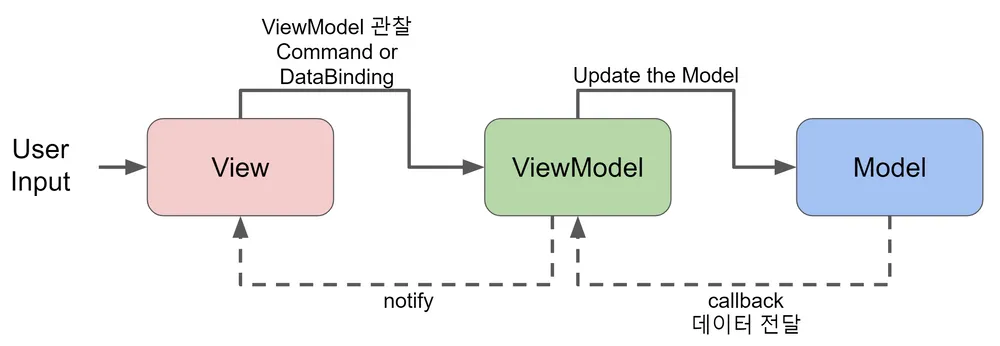

## Vue?

공식 문서에 따르면 Vue는 User Interfaces를 build하기 위한 Javascript framework라고 나와 있고 선언적이고 component를 기반으로한 UI를 만들 수 있다고 간단히 설명이 되어 있다.

### Vue의 특징

### Design pattern



따르고 있는 Design pattern은 MVVM(Model, View, View Model)으로 UI와 비 UI 코드를 분리할 수 있다. 즉 Model은 비 UI 코드(데이터)를 담당하고 View는 UI를 담당하며 View Model은 View에 바인딩을 하여 Model의 데이터를 View에 표현한다. 이러한 구조는 Model과 View를 분리하여 유지보수가 쉽고, 재사용성이 높아진다.

### Single File Component

```html
<script>
  export default {
    data() {
      return {
        count: 0,
      };
    },
  };
</script>

<template>
  <button @click="count++">Count is: {{ count }}</button>
</template>

<style scoped>
  button {
    font-weight: bold;
  }
</style>
```

Vue는 Single File Component를 지원한다. 이는 위와 같이 HTML, CSS, Javascript를 하나의 파일에 담아서 관리할 수 있게 해준다.

이는 Vue의 장점 중 하나로 기존 HTML, CSS, Javascript 문법을 사용하기 때문에 쉽게 Vue에 적응할 수 있게 도와준다. 또한 scoped라는 keyword를 사용하여 CSS를 Component 단위로 관리할 수 있게 해준다.

### Composition API

기존에는 Options API 방식을 사용했지만 Composition API가 추가 되면서 선택지가 늘어났다. 어쨋든 둘은 script 부분에서 데이터를 관리하는 것인데 분명한 차이가 존재한다.

일단 공식 문서에서 명시적으로 작거나 build tool를 사용하지 않을 땐 Options API를 사용하고 크거나 Vue를 Full로 사용할 땐 Composition API를 사용하라고 명시하고 있다.

```html
<script setup>
  import { ref, onMounted } from "vue";

  // reactive state
  const count = ref(0);

  // functions that mutate state and trigger updates
  function increment() {
    count.value++;
  }

  // lifecycle hooks
  onMounted(() => {
    console.log(`The initial count is ${count.value}.`);
  });
</script>

<template>
  <button @click="increment">Count is: {{ count }}</button>
</template>
```

위는 Compostion API를 사용한 예시이다. script 옆에 setup keyword를 사용하여 Composition API를 사용한다고 명시해줘야 한다. ref 함수를 사용하여 reactive state를 만들고 onMounted 함수를 사용하여 lifecycle hook을 사용할 수 있다.

life cycle hook이라는 부분을 보면 React의 Hooks와 똑같나? 라는 생각이 들 수도 있다. React Hooks에서 영감을 얻어 만든 것은 맞지만 manually하게 callback 함수를 cache해서 불필요한 child updates를 피하거나 업데이트를 위한 dependency를 추적하는 것과 같은 작업을 자동으로 수행한다.

## Quick Start

### Creating Vue Project

```bash
npm create vue@3
npm install
npm run format
npm run dev
```

`npm create vue@3` 명령어를 통해 vite 기반의 Vue 프로젝트를 만들 수 있다.

### Vscode Extension

- Vue Language Features(vetur)
  - Vue 파일의 문법을 지원해준다.
- TypeScript Vue Plugin(volar)
  - TS server plugin for Vue
- Vue VSCode Snippets
  - Vue의 snippet을 지원해준다.

Vue와 관련된 Extension을 설치해준다.

> Chrome Extension - Vue.js devtools도 설치해줘야 Vue 프로젝트를 디버깅할 수 있다.

### v- prefix

Vue에서는 v- prefix를 사용하여 directive를 사용할 수 있다. directive는 HTML element에 특별한 행동을 추가할 수 있게 해준다.

#### binding

앞서 MVVM 패턴에서 View Model이 Model의 데이터를 View에 표현하는 것을 보았다. 이를 binding이라고 한다. Vue에서는 binding을 사용하여 Model의 데이터를 View에 표현할 수 있다.

```html
<div id="app">
  <p>{{ message }}</p>
  <input v-bind:value="message" />
</div>
<script>
  const app = Vue.createApp({
    // options API
    data() {
      return {
        message: "Hello Vue!",
      };
    },
  });
  app.mount("#app");
</script>
```

위와 같이 {{ message }}를 사용하여 Model의 데이터를 View에 표현할 수 있다. 또한 v-bind:value를 사용하여 Model의 데이터를 속성에 바인딩할 수 있다. 단 v-bind는 단방향 바인딩이기 때문에 input의 value를 변경하면 Model의 데이터는 변경되지 않는다.

#### two-way binding

```html
<div id="app">
  <input v-model="message" />
</div>
```

v-model을 사용하면 two-way binding을 할 수 있다. 즉 input의 value를 변경하면 Model의 데이터도 변경되고 Model의 데이터를 변경하면 input의 value도 변경된다.

#### 기타

- v-if
  - 조건에 따라 element를 표현할 수 있다.
- v-on
  - event를 처리할 수 있다.
- v-for
  - 반복문을 사용할 수 있다.
  - e.g. v-for="item in items"

### Component

앞서 Vue는 Component 기반의 Framework이라고 했다. 따라서 이러한 개념을 이해하는 것이 중요하다고 할 수 있다.

#### Component 정의

Component를 정의하는 방법은 크게 2가지가 있다.

- String Template
  - js파일에 template string을 사용해서 정의하는 방법
- Single File Component
  - 앞서 설명했으므로 생략

> Component 이름은 PascalCase를 사용한다.

#### Component 등록

Component를 등록하는 방법은 크게 2가지가 있다.

- Global Registration
  - `Vue.createApp().component('ComponentName', ComponentName)`를 사용하여 전역으로 등록하는 방법
- Local Registration
  - `Vue.createApp({components: {ComponentName: ComponentName}})`를 사용하여 지역으로 등록하는 방법

만약에 전역으로 등록을 하면 모든 컴포넌트에서 사용할 수 있지만, 사용하지 않는 컴포넌트여도 최종 빌드에 포함되기 때문에 성능에 영향을 줄 수 있다. 따라서 지역으로 등록하는 것이 좋다.
